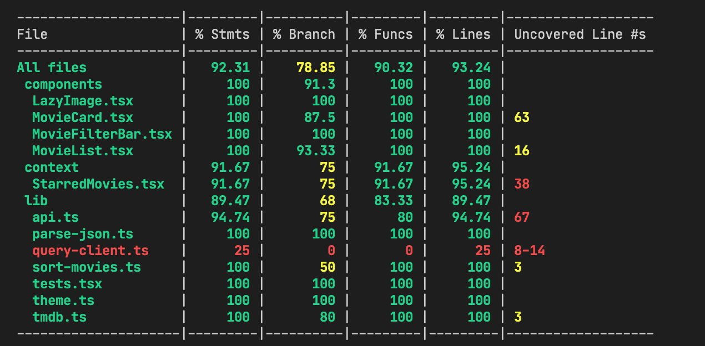

# Color Elephant Demo Project

Visit [here to see the live site](https://color-elephant-demo.vercel.app/)

View specification [here](https://docs.google.com/document/d/1I7vZ_1FQ74_tuJY-WkO_61BMQ-enwC8aQ2SYvqEvhQg/edit?usp=sharing)

## ⚛️ Technology

- Built with Next.js, React and Typescript
- UI built with [Chakra UI](https://chakra-ui.com/)
- Testing with Jest & React Testing Library
- Based on https://github.com/jpedroschmitz/typescript-nextjs-starter

## 💼 Dependencies

- `lazysizes` Lazy image loading
- `react-intersection-observer` For infinite scroll using IntesectionObserver (and testing)
- `react-query` Data fetching and caching
- `@chakra-ui/*` Chakra UI
  - `framer-motion` Chakra UI dependency
  - `@emotion/*` Chakra UI dependency
- `@meronex/icons` Custom SVG Icons
## 🚀 Getting started

1. `npm install` or `yarn`;
2. `yarn dev`;
   
To view the project open `http://localhost:3000`.

## Testing

`yarn test`

__Coverage__

---

Made with ♥ by Jesse Onolememen
